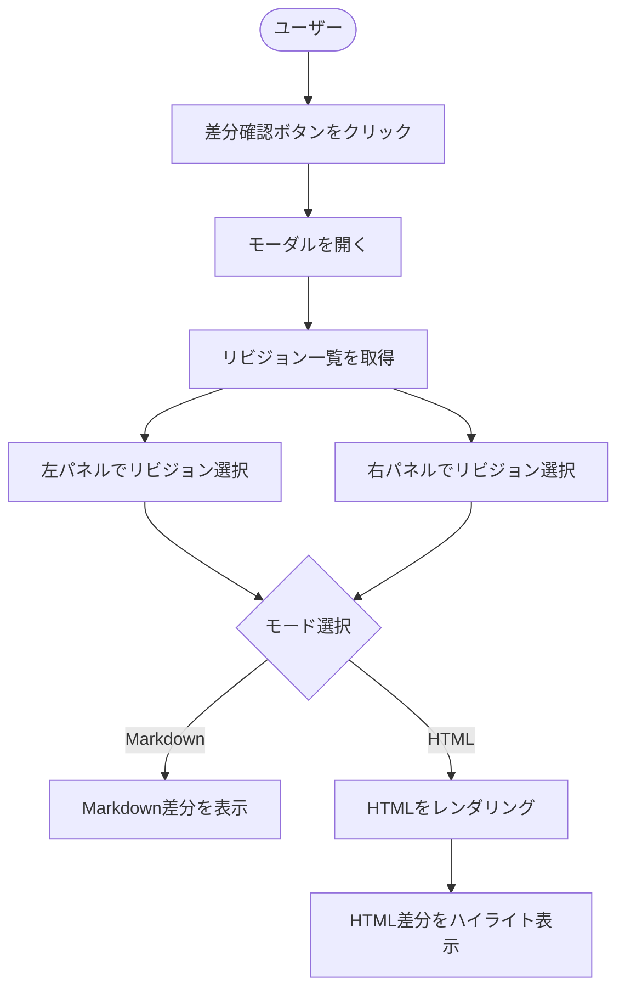

# 機能設計書

## システム構成図

```
┌─────────────────────────────────────────────────────────────┐
│                        Growi フロントエンド                    │
│                                                             │
│  ┌──────────────┐    ┌───────────────────────────────────┐  │
│  │   Sidebar    │    │       RevisionDiff Plugin          │  │
│  │              │    │                                   │  │
│  │ [差分確認ボタン]──→│  ┌─────────────────────────────┐  │  │
│  │              │    │  │   RevisionDiffModal           │  │  │
│  └──────────────┘    │  │                             │  │  │
│                      │  │  [左パネル]    [右パネル]    │  │  │
│                      │  │  ドロップダウン  ドロップダウン│  │  │
│                      │  │  差分表示      差分表示     │  │  │
│                      │  │                             │  │  │
│                      │  │  [Markdown] [HTML] 切替     │  │  │
│                      │  └─────────────────────────────┘  │  │
│                      └───────────────────────────────────┘  │
└─────────────────────────────────────────────────────────────┘
                              │
                              ↓ Growi API
┌─────────────────────────────────────────────────────────────┐
│                      Growi バックエンド                        │
│  - GET /api/v3/revisions?pageId={id}  リビジョン一覧取得      │
│  - GET /api/v3/revisions/{id}         リビジョン詳細取得      │
│  - POST /api/v3/pages.renderHtml      HTML レンダリング       │
└─────────────────────────────────────────────────────────────┘
```

## コンポーネント設計

### プラグインエントリーポイント

| コンポーネント | 役割 |
|---|---|
| `index.js` | プラグイン登録・Sidebar ボタン注入 |
| `RevisionDiffModal` | 差分確認モーダル本体（React コンポーネント） |
| `RevisionSelector` | リビジョン選択ドロップダウン |
| `DiffViewer` | 差分表示領域（Markdown / HTML 両モード対応） |
| `RevisionDiffService` | Growi API 呼び出し・データ変換ロジック |

### コンポーネント階層

```
SidebarButton（Growi Sidebar に注入）
└── RevisionDiffModal
    ├── ModalHeader（タイトル・モード切替・閉じるボタン）
    ├── LeftPanel
    │   ├── RevisionSelector（左リビジョン選択）
    │   └── DiffViewer（左側差分表示）
    └── RightPanel
        ├── RevisionSelector（右リビジョン選択）
        └── DiffViewer（右側差分表示）
```

## データモデル定義

### Revision（Growi APIレスポンス）

```typescript
interface Revision {
  _id: string;           // リビジョンID
  body: string;          // Markdown本文
  createdAt: string;     // 作成日時（ISO 8601）
  author: {
    _id: string;
    name: string;
  };
}
```

### RevisionWithNo（プラグイン内部データ）

```typescript
interface RevisionWithNo {
  revisionNo: number;    // 日付ソート連番（1始まり）
  _id: string;           // リビジョンID
  body: string;          // Markdown本文
  createdAt: string;     // 作成日時（ISO 8601）
  label: string;         // ドロップダウン表示用ラベル
                         // 例: "3 - abc123 - 2025-01-15 10:30"
}
```

### DiffMode

```typescript
type DiffMode = 'markdown' | 'html';
```

## ユースケース図



## 画面遷移・ワイヤフレーム

### Sidebarボタン

```
┌────────────────┐
│  Sidebar       │
│  ┌──────────┐  │
│  │ [既存btn]│  │
│  ├──────────┤  │
│  │ [差分確認]│  ← 本プラグインのボタン（同一スタイル）
│  └──────────┘  │
└────────────────┘
```

### 差分確認モーダル

```
┌────────────────────────────────────────────────────────────┐
│  リビジョン差分確認                          [Markdown][HTML] [×]│
├───────────────────────────┬────────────────────────────────┤
│ リビジョン: [▼ 1 - abc - 2025/01/01] │ リビジョン: [▼ 3 - xyz - 2025/01/15] │
├───────────────────────────┼────────────────────────────────┤
│                           │                                │
│  # タイトル               │  # タイトル                    │
│                           │                                │
│  本文テキスト             │  本文テキスト（変更後）         │
│ ██████████████（削除）    │                                │
│                           │  ████████████（追加）          │
│                           │                                │
└───────────────────────────┴────────────────────────────────┘
```

## API設計

### 使用するGrowiエンドポイント

#### リビジョン一覧取得

```
GET /api/v3/revisions?pageId={pageId}&limit=100
```

レスポンス例：
```json
{
  "docs": [
    {
      "_id": "abc123",
      "body": "# タイトル\n本文",
      "createdAt": "2025-01-15T10:30:00.000Z"
    }
  ]
}
```

#### HTMLレンダリング（Growiエンジン使用）

GrowiのMarkdown→HTMLレンダリングには、Growiが提供するクライアントサイドAPIまたはサーバーサイドエンドポイントを使用する。
実装時にGrowiのソースコードを参照して適切な方法を選定する。

## 差分アルゴリズム設計

### Markdown差分

- **使用ライブラリ候補：** `diff`（jsdiff）または Growi既存の差分ロジックを流用
- **表示方法：** 削除行を赤系ハイライト、追加行を緑系ハイライト

### HTML差分

1. 左右それぞれのMarkdownをGrowiレンダリングエンジンでHTMLに変換
2. 変換後のHTMLに対してDOM差分を算出
3. 差分箇所のノードに背景色を適用
   - 削除部分：`background-color: #ffe0e0`（淡いピンク）
   - 追加部分：`background-color: #e0ffe0`（淡い緑）
- **使用ライブラリ候補：** `diff-dom`、`htmldiff-js`、または `diff` ライブラリでテキストベース差分後にHTML内で適用

## revisionNo計算ロジック

```
1. APIからリビジョン一覧を取得
2. createdAt（日時）の昇順でソート（古いものが先）
3. ソート後の配列インデックス + 1 を revisionNo として割り当て
4. ドロップダウン表示ラベルを生成：
   "{revisionNo} - {_id（先頭8文字）} - {createdAt（整形済み日時）}"
```
